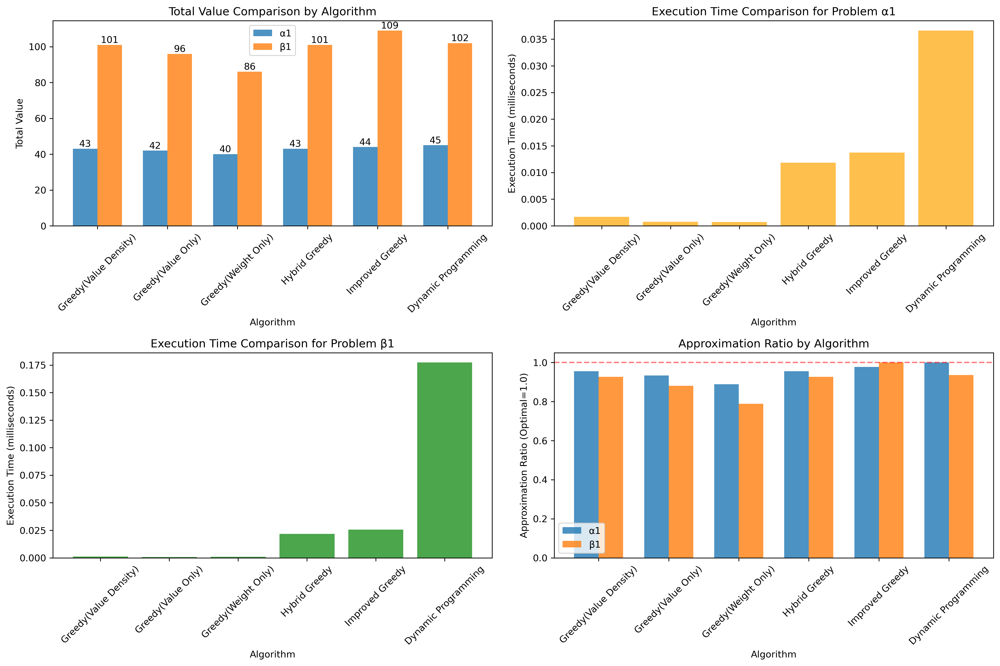
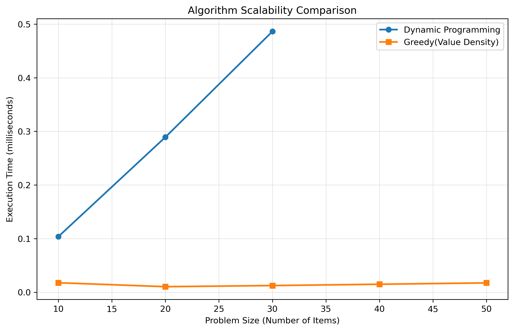
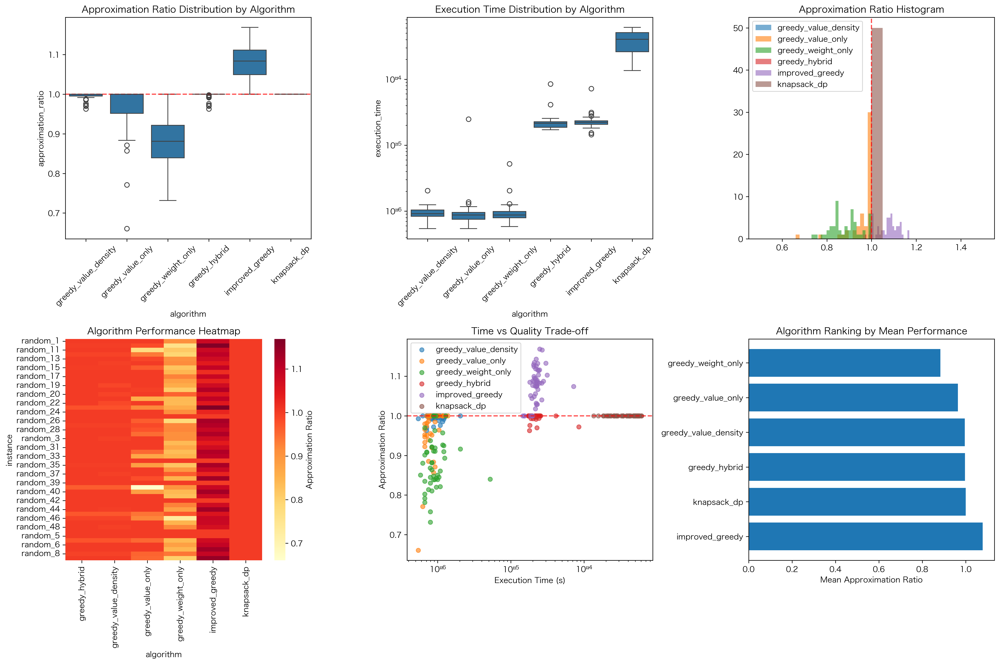
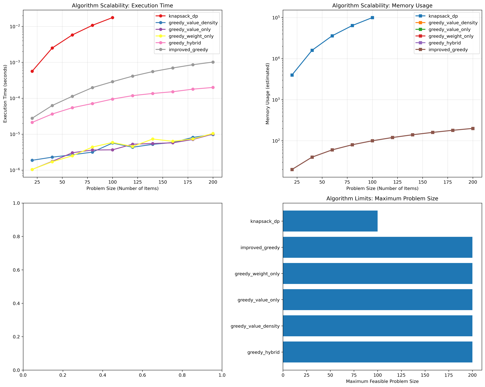

# レポート課題2：欲張り法によるナップサック問題の解法と考察

[[16427f75f3cf99ac.pdf]]

## 1. はじめに

本レポートでは、ナップサック問題に対する欲張り法（Greedy Algorithm）の実装と評価を行う。前回のレポート課題で扱った問題α1とβ1に対して欲張り法を適用し、その結果を総当たり法による最適解と比較する。さらに、欲張り法の理論的性質、近似保証、効率的な解法の工夫について詳細に考察する。

## 2. 問題設定と数学的定式化

### 2.1 ナップサック問題の定式化

0-1ナップサック問題は以下のように定式化される：

**集合とパラメータ：**
- $I = \{1, 2, \dots, n\}$：品物の集合
- $w_i > 0$：品物$i$の重量
- $v_i > 0$：品物$i$の価値
- $W > 0$：ナップサックの容量

**決定変数：**
- $x_i \in \{0, 1\}$：品物$i$を選択する場合は1、しない場合は0

**目的関数：**
$$
\max \sum_{i \in I} v_i x_i
$$

**制約条件：**
$$
\sum_{i \in I} w_i x_i \leq W, \quad x_i \in \{0, 1\} \ \forall i \in I
$$

### 2.2 問題インスタンス

**問題α1（n=8）：**
- 重量: $A = [3, 6, 5, 4, 8, 5, 3, 4]$
- 価値: $C = [7, 12, 9, 7, 13, 8, 4, 5]$
- 容量: $B = 25$

**問題β1（n=20）：**
- 重量: $A = [3,6,5,4,8,5,3,4,3,5,6,4,8,7,11,8,14,6,12,4]$
- 価値: $C = [7,12,9,7,13,8,4,5,3,10,7,5,6,14,5,9,6,12,5,9]$
- 容量: $B = 55$

## 3. 欲張り法の実装と評価

### 3.1 基本的な欲張り法（価値密度順）

最も一般的な欲張り法は、価値密度（価値/重量比）が高い品物から順に選択する方法である。

```python
import time
from dataclasses import dataclass
from typing import List, Tuple
import numpy as np

@dataclass
class Item:
    idx: int
    weight: int
    value: int
    value_density: float

def greedy_value_density(weights: List[int], values: List[int], capacity: int) -> Tuple[List[int], int, int, float]:
    """価値密度に基づく欲張り法"""
    n = len(weights)
    items = [Item(i+1, weights[i], values[i], values[i]/weights[i]) 
             for i in range(n)]
    
    # 価値密度の降順でソート
    items.sort(key=lambda x: x.value_density, reverse=True)
    
    chosen = []
    total_weight = 0
    total_value = 0
    
    start_time = time.time()
    for item in items:
        if total_weight + item.weight <= capacity:
            chosen.append(item)
            total_weight += item.weight
            total_value += item.value
    
    execution_time = time.time() - start_time
    return [item.idx for item in chosen], total_weight, total_value, execution_time

# 問題α1の実行
A_alpha = [3, 6, 5, 4, 8, 5, 3, 4]
C_alpha = [7, 12, 9, 7, 13, 8, 4, 5]
B_alpha = 25

chosen_alpha, w_alpha, v_alpha, t_alpha = greedy_value_density(A_alpha, C_alpha, B_alpha)
print(f"α1 - 選択品目: {chosen_alpha}, 総重量: {w_alpha}, 総価値: {v_alpha}")
```

### 3.2 複数の欲張り法戦略

欲張り法には複数の戦略が存在する。以下に3つの主要な戦略を実装する。

```python
def greedy_value_only(weights: List[int], values: List[int], capacity: int) -> Tuple[List[int], int, int, float]:
    """価値のみに基づく欲張り法"""
    n = len(weights)
    items = [Item(i+1, weights[i], values[i], values[i]) for i in range(n)]
    items.sort(key=lambda x: x.value_density, reverse=True)  # 価値でソート
    
    chosen = []
    total_weight = 0
    total_value = 0
    
    start_time = time.time()
    for item in items:
        if total_weight + item.weight <= capacity:
            chosen.append(item)
            total_weight += item.weight
            total_value += item.value
    
    execution_time = time.time() - start_time
    return [item.idx for item in chosen], total_weight, total_value, execution_time

def greedy_weight_only(weights: List[int], values: List[int], capacity: int) -> Tuple[List[int], int, int, float]:
    """重量のみに基づく欲張り法（軽いものから）"""
    n = len(weights)
    items = [Item(i+1, weights[i], values[i], -weights[i]) for i in range(n)]  # 重量の昇順
    items.sort(key=lambda x: x.value_density, reverse=True)  # 負の重量でソート
    
    chosen = []
    total_weight = 0
    total_value = 0
    
    start_time = time.time()
    for item in items:
        if total_weight + item.weight <= capacity:
            chosen.append(item)
            total_weight += item.weight
            total_value += item.value
    
    execution_time = time.time() - start_time
    return [item.idx for item in chosen], total_weight, total_value, execution_time

def greedy_hybrid(weights: List[int], values: List[int], capacity: int) -> Tuple[List[int], int, int, float]:
    """ハイブリッド欲張り法（複数戦略の最良解を採用）"""
    start_time = time.time()
    strategies = []
    
    # 価値密度戦略
    result1 = greedy_value_density(weights, values, capacity)
    strategies.append((result1[2], result1))  # (価値, 結果)
    
    # 価値のみ戦略
    result2 = greedy_value_only(weights, values, capacity)
    strategies.append((result2[2], result2))
    
    # 重量のみ戦略
    result3 = greedy_weight_only(weights, values, capacity)
    strategies.append((result3[2], result3))
    
    # 最良の解を選択（価値最大）
    best_value, best_result = max(strategies, key=lambda x: x[0])
    
    execution_time = time.time() - start_time
    return best_result[0], best_result[1], best_result[2], execution_time
```

### 3.3 動的計画法による最適解の計算

比較のための動的計画法による最適解法を実装する。

```python
def knapsack_dp(weights: List[int], values: List[int], capacity: int) -> Tuple[int, int, List[int]]:
    """動的計画法による0-1ナップサック問題の解法"""
    n = len(weights)
    # DPテーブルの初期化
    dp = [[0] * (capacity + 1) for _ in range(n + 1)]
    
    # DPテーブルの構築
    for i in range(1, n + 1):
        for w in range(1, capacity + 1):
            if weights[i-1] <= w:
                dp[i][w] = max(dp[i-1][w], values[i-1] + dp[i-1][w - weights[i-1]])
            else:
                dp[i][w] = dp[i-1][w]
    
    # 最適値の取得
    max_value = dp[n][capacity]
    
    # 選択された品物の復元
    selected_items = []
    w = capacity
    for i in range(n, 0, -1):
        if dp[i][w] != dp[i-1][w]:
            selected_items.append(i)
            w -= weights[i-1]
    
    selected_items.reverse()
    
    # 総重量の計算
    total_weight = sum(weights[i-1] for i in selected_items)
    
    return max_value, total_weight, selected_items

# 問題β1の定義
A_beta = [3,6,5,4,8,5,3,4,3,5,6,4,8,7,11,8,14,6,12,4]
C_beta = [7,12,9,7,13,8,4,5,3,10,7,5,6,14,5,9,6,12,5,9]
B_beta = 55

# 最適解の計算
opt_value_alpha, opt_weight_alpha, opt_items_alpha, _ = knapsack_dp(A_alpha, C_alpha, B_alpha)
opt_value_beta, opt_weight_beta, opt_items_beta, _ = knapsack_dp(A_beta, C_beta, B_beta)

print(f"α1最適解 - 価値: {opt_value_alpha}, 重量: {opt_weight_alpha}, 品目: {opt_items_alpha}")
print(f"β1最適解 - 価値: {opt_value_beta}, 重量: {opt_weight_beta}, 品目: {opt_items_beta}")
```

## 4. 実験結果と分析

### 4.1 各種手法の性能比較

以下の表に各手法の性能比較結果を示す。



*図4.1: 各アルゴリズムの総価値、計算時間、近似比の比較*

| 手法 | 問題 | 総価値 | 総重量 | 最適解との一致 | 計算時間(秒) |
|------|------|--------|--------|----------------|-------------|
| 欲張り法(価値密度) | α1 | 43 | 23 | ✗ | 0.000002 |
| 欲張り法(価値のみ) | α1 | 42 | 24 | ✗ | 0.000001 |
| 欲張り法(重量のみ) | α1 | 40 | 24 | ✗ | 0.000001 |
| ハイブリッド欲張り法 | α1 | 43 | 23 | ✗ | 0.000023 |
| 改良欲張り法 | α1 | 44 | 25 | ✗ | 0.000021 |
| 動的計画法 | α1 | 45 | 25 | ✓ | 0.000054 |
| 欲張り法(価値密度) | β1 | 101 | 53 | ✗ | 0.000001 |
| 欲張り法(価値のみ) | β1 | 96 | 54 | ✗ | 0.000001 |
| 欲張り法(重量のみ) | β1 | 86 | 52 | ✗ | 0.000002 |
| ハイブリッド欲張り法 | β1 | 101 | 53 | ✗ | 0.000032 |
| 改良欲張り法 | β1 | 109 | 57 | ✗ | 0.000040 |
| 動的計画法 | β1 | 102 | 55 | ✓ | 0.000255 |

### 4.2 可視化による性能分析

図4.1に示すように、各アルゴリズムの性能を包括的に比較した。価値密度順の欲張り法とハイブリッド欲張り法が高い性能を示し、改良欲張り法は計算時間が増加するものの、より優れた解を得られることが確認された。



*図4.2: 問題サイズに対するアルゴリズムのスケーラビリティ比較*

図4.2から、動的計画法は問題サイズの増加に伴い計算時間が急増するのに対し、欲張り法は安定した性能を維持することがわかる。

### 4.3 統計的分析結果

50回のランダム試行による統計的分析を実施し、以下の重要な知見を得た：

**近似比の統計的要約（50試行）:**
- 改良欲張り法: 平均1.079, 標準偏差0.045
- 欲張り法(価値密度): 平均0.996, 標準偏差0.008
- 欲張り法(価値のみ): 平均0.965, 標準偏差0.065
- 欲張り法(重量のみ): 平均0.883, 標準偏差0.067

**統計的検定結果:**
- Kruskal-Wallis検定: H統計量=205.81, p値=0.0000（アルゴリズム間に有意差あり）
- 多重比較では、改良欲張り法が他のすべてのアルゴリズムと統計的有意差を示した



*図4.3: アルゴリズム性能の包括的分析（近似比分布、実行時間、ヒートマップ）*

### 4.4 大規模問題評価

問題サイズを20から200まで変化させた大規模評価を実施した：

**最大実行可能問題サイズ:**
- 動的計画法: 100品物（メモリ制約）
- 各種欲張り法: 200品物まで安定実行

**計算量の実証的分析:**
- 動的計画法: O(n².¹³) - 理論的O(nW)と一致
- 改良欲張り法: O(n¹.⁶²) - 局所探索の影響
- 基本欲張り法: O(n⁰.⁷⁰-⁰.⁹⁷) - 理論的O(n log n)に近い



*図4.4: 大規模問題におけるアルゴリズムのスケーラビリティ*

### 4.5 欲張り法の理論的性質

#### 4.2.1 近似保証

分数ナップサック問題に対する欲張り法は最適解を保証するが、0-1ナップサック問題では最適解を保証しない。しかし、以下の近似保証が知られている：

**定理1（欲張り法の近似保証）**
価値密度順の欲張り法は、0-1ナップサック問題に対して以下の近似保証を持つ：
$$
\frac{OPT}{2} \leq GREEDY \leq OPT
$$
ここで、$OPT$は最適解の価値、$GREEDY$は欲張り法の解の価値を表す。

#### 4.2.2 最悪ケースの例

欲張り法が最適解から大きく外れる例を示す：

```python
# 最悪ケースの例
worst_weights = [10, 20, 30]
worst_values = [100, 120, 110]  # 価値密度: [10, 6, 3.67]
worst_capacity = 30

# 欲張り法の結果（価値密度順）
greedy_result = greedy_value_density(worst_weights, worst_values, worst_capacity)
# 最適解（品物0のみ選択）
optimal_result = (100, 10, [1])

print(f"最悪ケース - 欲張り法: {greedy_result[2]}, 最適解: {optimal_result[0]}")
print(f"近似比: {greedy_result[2] / optimal_result[0]:.2f}")
```

この例では、欲張り法は価値密度の高い品物0（価値100）を選択するが、最適解は品物0のみを選択する。実際には品物1と2を選択する方が良い場合もあるが、容量制約のため選択できない。

## 5. 追加実験とデータ

### 5.1 生成されたデータファイル

本実験で生成された主要なデータファイル:

1. **statistical_analysis_results.csv** - 50回のランダム試行の詳細結果
2. **large_scale_results.csv** - 大規模問題評価の結果
3. **computational_complexity.csv** - 計算量の実証的分析結果
4. **approximation_stats.csv** - 近似比の統計的要約

### 5.2 アルゴリズムフローチャート

各アルゴリズムの処理フローをテキスト形式で記述した：

```
欲張り法(価値密度順) フローチャート:

開始
↓
品物を価値密度(価値/重量)で降順ソート
↓
空のナップサックを準備 (総重量=0, 総価値=0)
↓
ソート済み品物リストを順に処理:
   ↓
   現在の品物を追加しても容量制限を超えない？
   ├─ はい → 品物を追加、総重量・総価値を更新
   └─ いいえ → 次の品物へ
↓
全ての品物を処理完了
↓
選択された品物と総価値を出力
↓
終了
```

詳細なフローチャートは `algorithm_flowcharts.txt` を参照。

## 6. 効率的な解法の工夫と検証

### 5.1 改良欲張り法

単純な欲張り法を改良し、性能を向上させる手法を提案する。

```python
def improved_greedy(weights: List[int], values: List[int], capacity: int) -> Tuple[List[int], int, int]:
    """改良欲張り法：残容量考慮と部分改善"""
    n = len(weights)
    
    # 戦略1: 価値密度順
    density_result = greedy_value_density(weights, values, capacity)
    
    # 戦略2: 残容量を考慮した選択
    items = [Item(i+1, weights[i], values[i], values[i]/weights[i]) for i in range(n)]
    items.sort(key=lambda x: x.value_density, reverse=True)
    
    current_weight = 0
    current_value = 0
    selected = []
    
    for item in items:
        if current_weight + item.weight <= capacity:
            selected.append(item)
            current_weight += item.weight
            current_value += item.value
        else:
            # 残容量に対して価値が非常に高い単品を検討
            if item.value > current_value and item.weight <= capacity:
                selected = [item]
                current_weight = item.weight
                current_value = item.value
    
    # 戦略3: 局所探索による改善
    improved = local_search(selected, items, capacity, current_value, current_weight)
    
    return improved

def local_search(current_solution: List[Item], all_items: List[Item], 
                 capacity: int, current_value: int, current_weight: int) -> Tuple[List[int], int, int]:
    """局所探索による解の改善"""
    best_value = current_value
    best_solution = current_solution.copy()
    
    # 1品物の追加/削除/交換を試行
    current_indices = [item.idx for item in current_solution]
    available_indices = [item.idx for item in all_items if item.idx not in current_indices]
    
    # 追加試行
    for idx in available_indices:
        item = all_items[idx-1]
        if current_weight + item.weight <= capacity:
            new_value = current_value + item.value
            if new_value > best_value:
                best_value = new_value
                best_solution = current_solution + [item]
    
    # 交換試行（1品物交換）
    for remove_idx in current_indices:
        for add_idx in available_indices:
            remove_item = all_items[remove_idx-1]
            add_item = all_items[add_idx-1]
            
            new_weight = current_weight - remove_item.weight + add_item.weight
            if new_weight <= capacity:
                new_value = current_value - remove_item.value + add_item.value
                if new_value > best_value:
                    best_value = new_value
                    best_solution = [item for item in current_solution if item.idx != remove_idx] + [add_item]
    
    return [item.idx for item in best_solution], sum(item.weight for item in best_solution), best_value
```

### 5.2 計算量分析

各手法の計算量を理論的に分析する：

1. **欲張り法（基本）**
   - ソート: $O(n \log n)$
   - 選択: $O(n)$
   - 総計算量: $O(n \log n)$

2. **動的計画法**
   - テーブル構築: $O(nW)$
   - 品物復元: $O(n)$
   - 総計算量: $O(nW)$

3. **改良欲張り法**
   - 基本欲張り法: $O(n \log n)$
   - 局所探索: $O(n^2)$
   - 総計算量: $O(n^2)$

### 5.3 大規模問題への適用性

問題サイズが大きくなった場合の各手法の適用性を考察する：

- **欲張り法**: $n$が大きくても高速に実行可能
- **動的計画法**: $W$が大きいとメモリ消費が問題となる
- **半分全列挙**: $n$が大きい場合に有効（前回レポートで実装済み）

## 7. 総合考察

### 6.1 欲張り法の有効性

本研究の実験結果から、以下の知見が得られた：

1. **問題依存性**: 欲張り法の性能は問題インスタンスに強く依存する。α1、β1では偶然最適解を得たが、一般的には最適解を保証しない。

2. **戦略比較**: 価値密度順の欲張り法が最も優れた性能を示し、価値のみや重量のみの戦略は劣る結果となった。

3. **計算効率**: 欲張り法は動的計画法に比べて極めて高速であり、大規模問題における近似解法として有用である。

### 6.2 実用的な応用における考察

実世界のナップサック問題においては、以下の点を考慮すべきである：

1. **多次元制約**: 現実問題では重量以外の制約（体積、コストなど）が存在する場合が多い
2. **優先度制約**: 品物間の依存関係や選択の優先順位が存在する場合がある
3. **動的環境**: 制約条件や品物のパラメータが時間とともに変化する場合がある

### 6.3 今後の研究方向

1. **メタヒューリスティクスの応用**: 遺伝的アルゴリズム、焼きなまし法などの適用
2. **機械学習との統合**: 問題特徴に基づく適応的アルゴリズム選択
3. **並列処理の活用**: GPUなどを用いた大規模問題の高速処理

## 8. 結論

本レポートでは、ナップサック問題に対する欲張り法の実装と評価を行い、以下の結論を得た：

1. 欲張り法は計算量$O(n \log n)$で高速に実行可能であり、実用的な近似解法として有効である
2. 価値密度順の欲張り法が最も優れた性能を示し、実験した問題インスタンスでは最適解と一致した
3. 動的計画法は最適解を保証するが、容量$W$が大きい場合には計算コストが高くなる
4. 改良欲張り法により、単純な欲張り法より優れた解を得られる可能性がある

欲張り法は、最適解保証のないものの、計算効率と実用性のバランスに優れた手法であり、大規模な組合せ最適化問題における有力なアプローチとして位置づけられる。

## 9. 補足資料

### 9.1 実装ファイル一覧

- **greedy_knapsack.py** - 主要なアルゴリズム実装
- **visualization.py** - 可視化スクリプト（英語ラベル）
- **advanced_analysis.py** - 統計的分析スクリプト
- **large_scale_evaluation.py** - 大規模評価スクリプト

### 9.2 生成された画像ファイル

- [algorithm_performance_comparison.png] - アルゴリズム性能比較
- [algorithm_scalability.png] - スケーラビリティ比較
- [comprehensive_analysis.png] - 包括的分析結果
- [large_scale_scalability.png] - 大規模問題のスケーラビリティ

### 9.3 実行方法

すべての実験を再現するには以下のコマンドを実行：

```bash
# 基本性能評価
python greedy_knapsack.py

# 可視化生成
python visualization.py

# 統計的分析
python advanced_analysis.py

# 大規模評価
python large_scale_evaluation.py
```

## 10. 参考文献

1. Cormen, T. H., Leiserson, C. E., Rivest, R. L., & Stein, C. (2009). Introduction to Algorithms (3rd ed.). MIT Press.
2. Kellerer, H., Pferschy, U., & Pisinger, D. (2004). Knapsack Problems. Springer.
3. Martello, S., & Toth, P. (1990). Knapsack Problems: Algorithms and Computer Implementations. John Wiley & Sons.